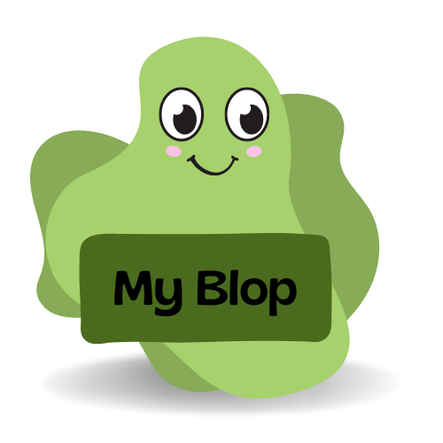

# My Blop

## Project presentation

I realized this project in the context of a project at [IUT Lyon 1](https://iut.univ-lyon1.fr/) in the second year of study.
This project is a full options a complete blog, the design ideas is based on the pun blog => blop and that's why the graphic charte is greed :).
In this blog, as an user you will be able to create an account and log in, see posts and categories from others users, create your owns posts and categories and comment and vote all the posts.
The project has been developped in [Symphony](https://symfony.com/), a PHP framework.

## Add your files

- [ ] [Find the GitHub repository here](https://github.com/Hubrec/My_blop) you can get all the code here, the repository is public so you can clone the project at your convenience.

## Try it now

You can become a member right now and post everything you want on [myblop.mathisguerin.fr](http://myblop.mathisguerin.fr) !

## Visuals

Here below are the different visuals of the application :
 - the homepage

    

 - the page of one post

    

 - the categories page

    

 - the user page

    

I let you discover more in depth the site by yourselves!

## Usage

This website aims to train in class in the framework php Symfony on the first plan, but it also claims to be a place where people meet and have a good time.

## Authors

**Mathis Guerin**

- [ ] [My GitHub](https://github.com/Hubrec)
- [ ] [My Linkedin](https://www.linkedin.com/in/mathis-guerin-43b228222/)

## License

This project is under a MIT liscence described in the [LICENCE.txt](./LICENCE.txt) on the project. 

## Project status

The porject is on a stable version and I didn't planned to change it for now.